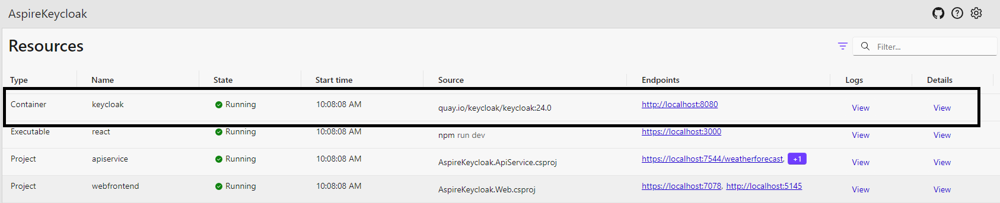
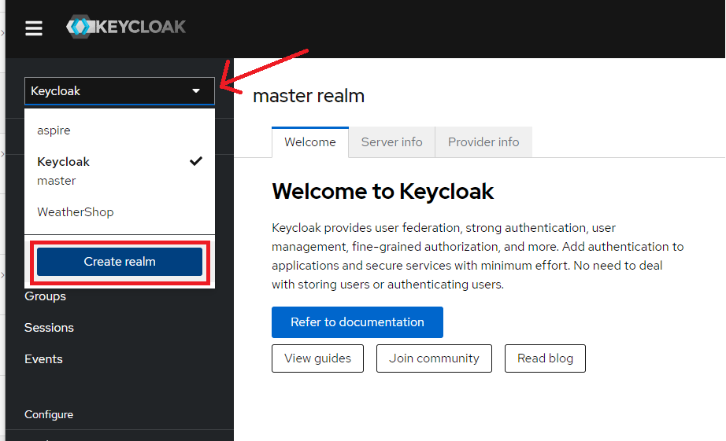
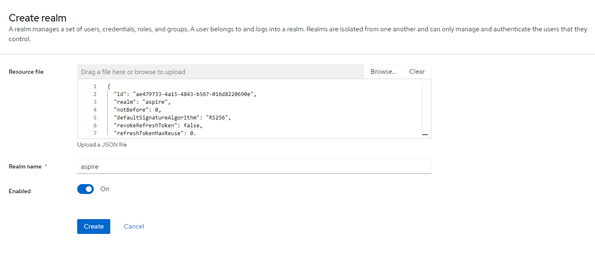

# Example application using Keycloak

This is a sample application consisting of Dockerized [Keycloak](https://www.keycloak.org/), an API, and both a Blazor client and a React client, all orchestrated by [.NET Aspire](https://learn.microsoft.com/en-us/dotnet/aspire/get-started/aspire-overview).

## Keycloak

[Keycloak](https://www.keycloak.org/) is an open-source identity provider that can be run in a container, making it easy to orchestrate and manage with Aspire. Keycloak can be run with a persistent disk in Docker, ensuring that running locally will be consistent and easy.

## Local setup

This is required to load the ASP.NET dev certificates for SSL

1. Navigate to `ApiService` project folder in command line
2. Run `dotnet dev-certs https -ep "{path to root folder}\ApsireKeycloak.React\certificates\aspnet_https.pem" --format pem -v -np`

## Import Aspire Realm in Keycloak

When you run the solution for the first time, Aspire will launch into the dashboard. From there you can navigate to the Keycloack Admin UI:

Enter the admin credentials specified in your AppHost config to log in to keycloak. Once logged in as the admin, click on the Realm dropdown and select `Create realm`:

At the top of the `Create realm` page, click `Browse` to supply a resource file. Choose `aspire-realm.json` at the root of the repository, and click on `Create`:

From there, you can add your own users to Keycloak. Navigating to either the React app or the Blazor app will prompt you to login to Keycloak as a user and call the protected API resource.
